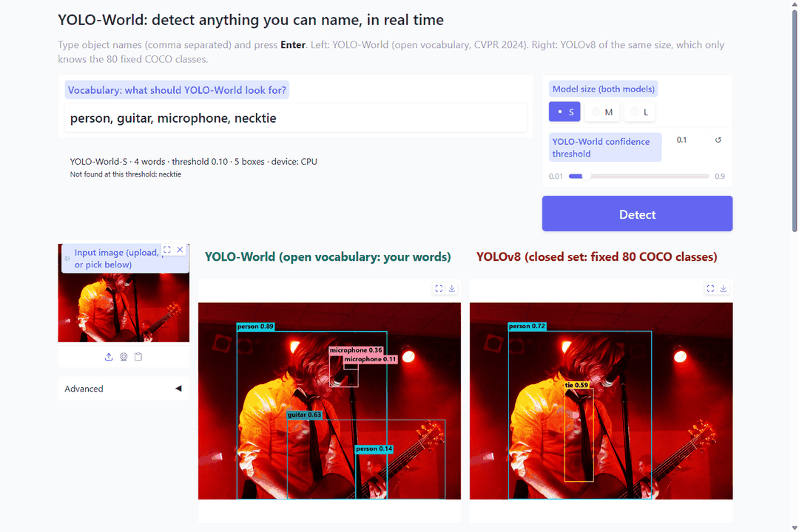
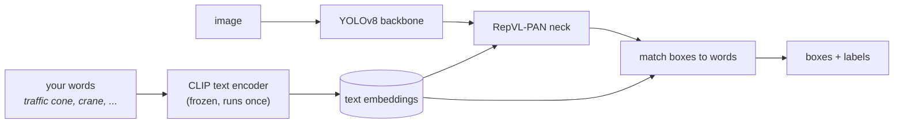
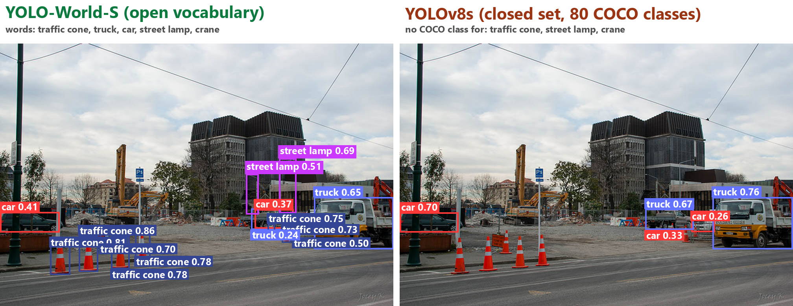
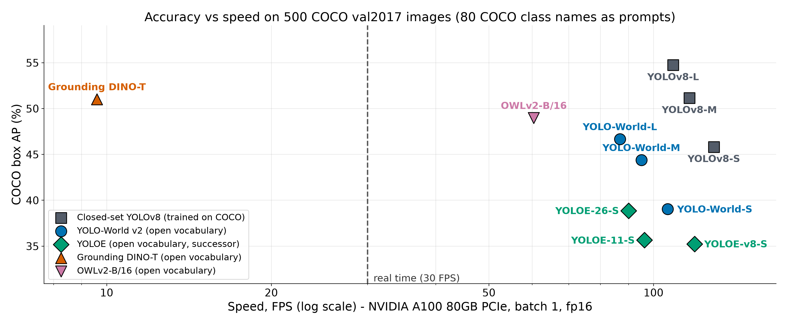
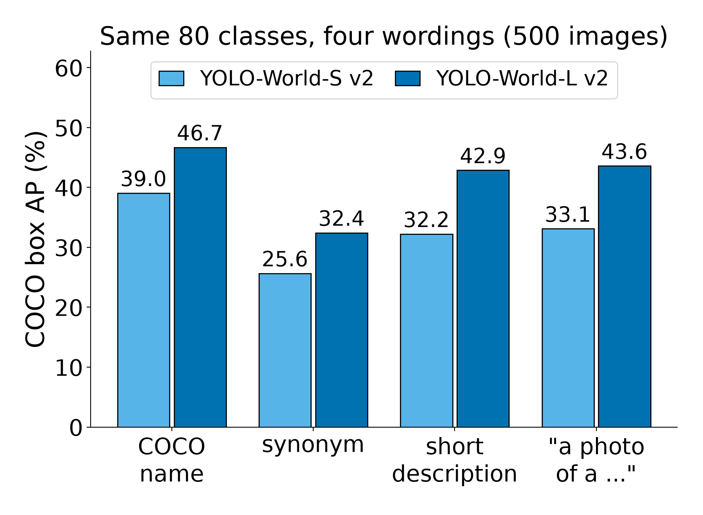
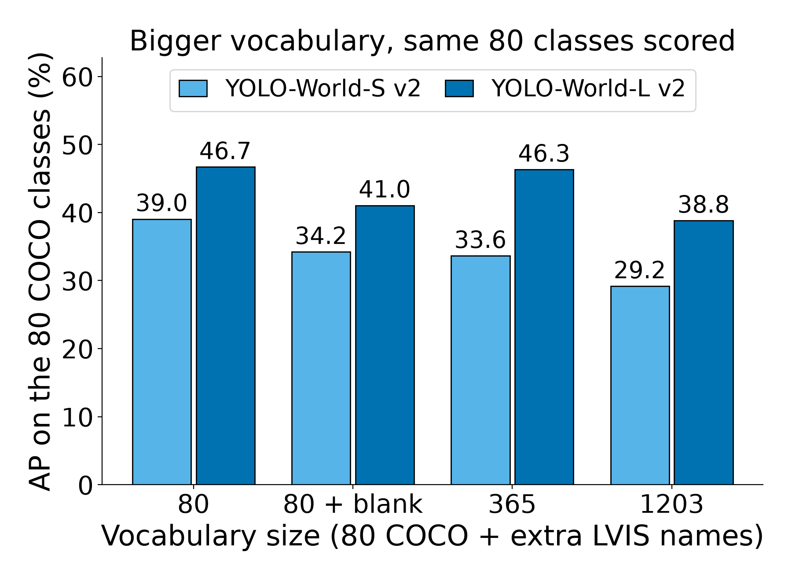

<h1 align="center">YOLO-World</h1>

<p align="center">
  <b>Detect anything you can name, in real time.</b><br>
  A demo, a Colab notebook and my own experiments for the CVPR 2024 paper.
</p>

<p align="center">
  <a href="https://colab.research.google.com/github/Rijifl/yolo-world/blob/main/notebooks/yolo_world_walkthrough.ipynb"></a>
  <a href="https://arxiv.org/abs/2401.17270"></a>
  
  
  
  <a href="LICENSE"></a>
</p>

<p align="center">
  
</p>

This is my journal-club project for CPSC 4420 (Clemson), by Ahmet Dokmeci. The paper is:

> Tianheng Cheng, Lin Song, Yixiao Ge, Wenyu Liu, Xinggang Wang, Ying Shan.
> **YOLO-World: Real-Time Open-Vocabulary Object Detection.** CVPR 2024.
> [paper](https://arxiv.org/abs/2401.17270) | [official code](https://github.com/AILab-CVC/YOLO-World)

## The idea

A normal detector like YOLOv8 can only output the classes it was trained on (80 for COCO). If you want "traffic cone", you have to label data and retrain.

YOLO-World keeps the fast YOLOv8 detector but lets you pick the classes at run time by typing words. A frozen CLIP text encoder turns the words into vectors, a new neck (RepVL-PAN) mixes them with the image features, and each box is scored by how well it matches each word.



The words are encoded once, before any image is seen (the paper calls this *prompt-then-detect*), so the text encoder costs nothing per frame. In the paper, YOLO-World-L reaches 35.4 AP zero-shot on LVIS minival at 52.0 FPS on a V100, with the text embeddings re-parameterized into the network. The earlier open-vocabulary detectors in the same table (GLIP-T, GLIPv2-T, Grounding DINO-T, DetCLIP-T) ran at 0.12 to 2.3 FPS on that GPU.

Same image, same model size. On the left you type the words; on the right, YOLOv8 has no class for three of them:

<p align="center">
  
</p>

## Try it

**In the browser (no install).** Open the notebook in Colab, switch to a T4 GPU and hit *Run all*. The last cell starts the demo with a public link.

<a href="https://colab.research.google.com/github/Rijifl/yolo-world/blob/main/notebooks/yolo_world_walkthrough.ipynb"></a>

**On your machine.**

```bash
git clone https://github.com/Rijifl/yolo-world.git
cd yolo-world
python -m venv .venv
source .venv/bin/activate             # Windows: .venv\Scripts\activate
pip install torch==2.6.0 torchvision==0.21.0 --index-url https://download.pytorch.org/whl/cu124
pip install -r requirements.txt
python scripts/download_models.py     # saves the weights in ./weights
python demo/app.py                    # http://localhost:7860
```

No NVIDIA GPU? Install plain `torch==2.6.0 torchvision==0.21.0` instead. It works on CPU, just slower.

| Option | What it does |
|---|---|
| `python demo/app.py --sizes S` | load only the small models (faster start, less memory) |
| `python demo/app.py --share` | also print a public gradio.live link |
| `DEMO_DEVICE=cpu` | force CPU |

## What's in here

```
demo/          Gradio app: YOLO-World next to closed-set YOLOv8 on the same image
  images/      8 sample photos from COCO val2017 (credits in ATTRIBUTION.md)
notebooks/     Colab walkthrough: closed set vs open vocabulary, "encode once" timing, prompt wording
experiments/   11-model accuracy/speed comparison and a prompt/vocabulary study
results/       CSVs, charts and the full report from my run, plus pre-computed demo images
scripts/       download the weights, pre-compute the demo images
```

## Results

I ran 11 detectors on the same **500 COCO val2017 images** (fixed seed), scored with standard COCO box AP, on **one NVIDIA A100** (Clemson's Palmetto cluster), batch size 1, fp16, no TensorRT. FPS is 1000 / the median time per image. All numbers come from the scripts in `experiments/`. The full tables are in [`results/README_results.md`](results/README_results.md).

<p align="center">
  
</p>

| Model | Open vocabulary | AP | FPS |
|---|:---:|---|---|
| YOLOv8-S / M / L (closed-set, trained on COCO) | no | 45.8 / 51.1 / 54.7 | 160 / 136 / 122 |
| **YOLO-World-S / M / L v2** | yes | **39.0 / 44.4 / 46.7** | **108 / 97 / 89** |
| YOLOE-v8-S / 11-S / 26-S | yes | 35.2 / 35.7 / 38.9 | 126 / 103 / 92 |
| OWLv2-B/16 | yes | 49.0 | 61 |
| Grounding DINO-T | yes | 51.0 | 9.7 |

What I found:

- **Open vocabulary has a price.** Next to a closed-set YOLOv8 of the same size (which was trained on COCO itself), YOLO-World is 7 to 8 AP lower and about 30% slower.
- **The speed claim holds.** YOLO-World-L is about 9 times faster than Grounding DINO-T (89 vs 9.7 FPS). On COCO, Grounding DINO-T is the more accurate of the two (51.0 vs 46.7 AP); the paper's accuracy comparison is on LVIS, not COCO.
- **The wording of the prompt matters.** For YOLO-World-S, naming the same 80 classes with synonyms drops AP from 39.0 to 25.6. Short descriptions give 32.2, and the template "a photo of a {name}" gives 33.1.
- **A bigger vocabulary does not cost speed.** YOLO-World-S stays at about 109 to 111 FPS from 1 to 1,203 words (a separate timing run from the table above, so it is not exactly 108).
- **A bigger vocabulary lowered AP, but part of that is my scoring.** With 1,203 words, AP on the 80 COCO classes falls from 39.0 to 29.2 (S), and one blank entry lowers it to 34.2. Ultralytics keeps one label per box and I drop boxes whose label is one of the added words, some of which are close to COCO classes ("sofa", "doughnut"), so I can't say how much of the drop is the model.

<p align="center">
  
  
</p>

These numbers are **not comparable with Table 2 of the paper**, which reports zero-shot Fixed AP on LVIS minival, on a V100. COCO's 80 classes are familiar to all of these models. The YOLO models also keep one class per box while OWLv2 and Grounding DINO keep the top 100 box-class pairs, which costs the YOLO models about 0.6 to 1.0 AP (see the sanity check in the full report).

### Reproduce

```bash
python scripts/download_models.py --experiments
python experiments/compare.py
python experiments/sanity_check.py
python experiments/prompt_study.py
python experiments/make_report.py
```

The COCO annotations and the 500 images download themselves on the first run. You need a GPU for the timing part.

## Notes

- The checkpoints are Ultralytics' `yolov8{s,m,l}-worldv2.pt`. That is **YOLO-World v2**, which the authors released in February 2024, a month after the arXiv preprint: it drops the Image-Pooling Attention and replaces the L2-Norm in the head with BatchNorm.
- Ultralytics **caches** the text embeddings after `set_classes()`. The paper goes one step further and folds them into the network weights (re-parameterization). The demo and my timings use the cached version.
- The pre-computed images in `results/demo/` were made on CPU, so the times in `results/demo/prebaked.json` are CPU times.

## Credits and licenses

- Sample images are COCO val2017 photos under CC BY 2.0 / CC BY-SA 2.0. Per-image credits: [`demo/images/ATTRIBUTION.md`](demo/images/ATTRIBUTION.md).
- My code is MIT (see [`LICENSE`](LICENSE)).
- It depends on [Ultralytics](https://github.com/ultralytics/ultralytics), which is **AGPL-3.0**. If you redistribute or serve this code, those terms apply.
- The official YOLO-World code is GPL-3.0.

## Citation

```bibtex
@inproceedings{cheng2024yolow,
  title     = {YOLO-World: Real-Time Open-Vocabulary Object Detection},
  author    = {Cheng, Tianheng and Song, Lin and Ge, Yixiao and Liu, Wenyu and Wang, Xinggang and Shan, Ying},
  booktitle = {Proceedings of the IEEE/CVF Conference on Computer Vision and Pattern Recognition (CVPR)},
  month     = {June},
  year      = {2024},
  pages     = {16901--16911}
}
```
