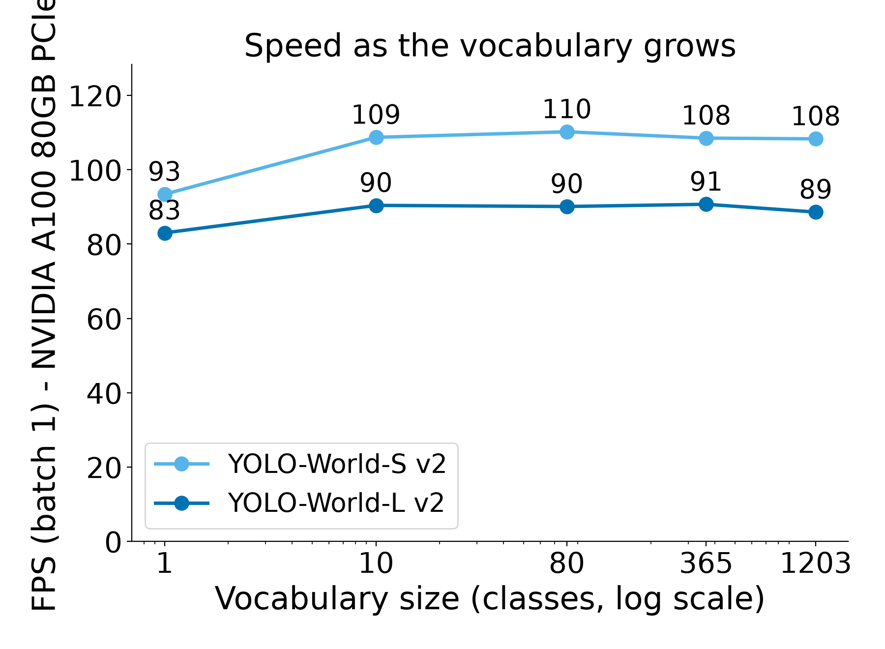

# Results

Generated by `experiments/make_report.py` from the CSVs in this folder. Do not edit by hand.

**Hardware and software:** NVIDIA A100 80GB PCIe, driver/limits `580.178.04, 300.00 W, 1410 MHz`, torch 2.6.0+cu124 (CUDA 12.4), ultralytics 8.4.166, transformers 5.17.0, Python 3.12.15, Linux-4.18.0-553.150.1.el8_10.x86_64-x86_64-with-glibc2.28

**Data:** 500 COCO val2017 images (fixed seed 0, ids in `coco_subset_ids.json`), scored with pycocotools box AP (IoU 0.50:0.95, max 100 detections per image).

**Settings for every model:** the 80 plain COCO class names as the vocabulary, score threshold 0.001, batch size 1, fp16. Speed = mean wall-clock time per image for pre-processing + forward pass + post-processing with the image already in memory, after warm-up, with nothing else on the GPU. No TensorRT and no `torch.compile`.

## Experiment 1: accuracy and speed

| Model | Open vocab | AP | AP50 | APs | APm | APl | ms / image | FPS | Detector params (M) | Text encoding, 80 names (ms) | Peak VRAM (MB) | Error |
|---|---|---|---|---|---|---|---|---|---|---|---|---|
| YOLOv8-S (closed-set) | no | 45.8 | 63.6 | 29.2 | 49.7 | 62.0 | 7.8 | 128.9 | 11.2 | - | 117 |  |
| YOLOv8-M (closed-set) | no | 51.1 | 68.7 | 37.1 | 55.7 | 66.8 | 8.6 | 116.3 | 25.9 | - | 234 |  |
| YOLOv8-L (closed-set) | no | 54.7 | 71.8 | 40.3 | 59.9 | 70.3 | 9.2 | 108.6 | 43.7 | - | 410 |  |
| YOLO-World-S v2 | yes | 39.0 | 54.2 | 25.5 | 43.9 | 52.6 | 9.4 | 106.1 | 12.8 | 12.8 | 892 |  |
| YOLO-World-M v2 | yes | 44.4 | 60.6 | 30.6 | 48.9 | 58.4 | 10.5 | 95.0 | 28.4 | 12.7 | 1010 |  |
| YOLO-World-L v2 | yes | 46.7 | 62.7 | 33.2 | 51.2 | 59.1 | 11.5 | 86.8 | 46.8 | 12.7 | 1194 |  |
| YOLOE-v8-S | yes | 35.2 | 51.0 | 21.4 | 40.0 | 49.0 | 8.4 | 118.9 | 15.4 | 36.8 | 1040 |  |
| YOLOE-11-S | yes | 35.6 | 51.0 | 21.7 | 40.4 | 49.5 | 10.4 | 96.2 | 13.7 | 36.8 | 1055 |  |
| YOLOE-26-S | yes | 38.9 | 54.8 | 26.6 | 43.8 | 56.0 | 11.1 | 90.0 | 15.3 | 41.0 | 461 |  |
| Grounding DINO-T | yes | 51.0 | 66.8 | 39.3 | 54.6 | 64.7 | 104.1 | 9.6 | 63.4 | 10.6 | 1180 |  |
| OWLv2-B/16 | yes | 49.0 | 69.1 | 37.2 | 52.8 | 66.6 | 16.6 | 60.4 | 91.6 | 12.4 | 428 |  |

### YOLO-World against closed-set YOLOv8 of the same size

| Size | YOLOv8 AP | YOLO-World AP | AP gap | YOLOv8 FPS | YOLO-World FPS | YOLO-World speed |
|---|---|---|---|---|---|---|
| S | 45.8 | 39.0 | -6.8 | 128.9 | 106.1 | 82% |
| M | 51.1 | 44.4 | -6.8 | 116.3 | 95.0 | 82% |
| L | 54.7 | 46.7 | -8.1 | 108.6 | 86.8 | 80% |

The closed-set YOLOv8 models were trained on COCO itself; YOLO-World was not, so the AP gap is the price of not training on the test classes' own dataset.

### What each model was trained on

| Model | Checkpoint | Training data |
|---|---|---|
| YOLOv8-S (closed-set) | `weights/yolov8s.pt` | Supervised on COCO train2017 (all 80 classes) - NOT zero-shot; supervised reference |
| YOLOv8-M (closed-set) | `weights/yolov8m.pt` | Supervised on COCO train2017 (all 80 classes) - NOT zero-shot; supervised reference |
| YOLOv8-L (closed-set) | `weights/yolov8l.pt` | Supervised on COCO train2017 (all 80 classes) - NOT zero-shot; supervised reference |
| YOLO-World-S v2 | `weights/yolov8s-worldv2.pt` | O365v1 + GoldG (GQA + Flickr30k, COCO images excluded per paper); weights migrated from official repo |
| YOLO-World-M v2 | `weights/yolov8m-worldv2.pt` | O365v1 + GoldG (GQA + Flickr30k, COCO images excluded per paper); weights migrated from official repo |
| YOLO-World-L v2 | `weights/yolov8l-worldv2.pt` | O365v1 + GoldG (GQA + Flickr30k, COCO images excluded per paper); weights migrated from official repo |
| YOLOE-v8-S | `weights/yoloe-v8s-seg.pt` | O365v1 + GoldG (GQA + Flickr30k) with SAM masks (Ultralytics docs) |
| YOLOE-11-S | `weights/yoloe-11s-seg.pt` | O365v1 + GoldG (GQA + Flickr30k) with SAM masks (Ultralytics docs) |
| YOLOE-26-S | `weights/yoloe-26s-seg.pt` | O365v1 + GoldG (GQA + Flickr30k) with SAM 2.1 masks (Ultralytics docs) |
| Grounding DINO-T | `IDEA-Research/grounding-dino-tiny` | O365 + GoldG + Cap4M (groundingdino_swint_ogc; official repo model zoo) |
| OWLv2-B/16 | `google/owlv2-base-patch16-ensemble` | CLIP pre-train; self-train on WebLI pseudo-boxes; fine-tune on LVIS-base (COCO train2017 images); weight ensemble |

## Sanity check of the evaluation pipeline

| Model | Pipeline | AP | AP50 | Ultralytics internal mAP | Official reference |
|---|---|---|---|---|---|
| yolov8s | compare.py predict() path (single-label NMS, max_det 100) | 45.8 | 63.6 | - | 44.9 (Ultralytics docs, full val2017, 5000 imgs) |
| yolov8s-worldv2 | compare.py predict() path (single-label NMS, max_det 100) | 39.0 | 54.2 | - | 37.7 (Ultralytics docs, zero-shot COCO val2017) |
| yolov8s | Ultralytics model.val() (multi-label NMS, max_det 300 -> top-100 per image) | 46.4 | 64.7 | 45.8 | 44.9 (Ultralytics docs, full val2017, 5000 imgs) |
| yolov8s-worldv2 | Ultralytics model.val() (multi-label NMS, max_det 300 -> top-100 per image) | 40.0 | 54.9 | 39.5 | 37.7 (Ultralytics docs, zero-shot COCO val2017) |

The official numbers are for all 5,000 val2017 images; mine are for the subset, so a small difference is expected.

## Experiment 2: prompts

### A. Wording: the same 80 classes, four ways to name them

| Model | name (AP) | synonym (AP) | description (AP) | template (AP) | best - worst |
|---|---|---|---|---|---|
| YOLO-World-S v2 | 39.0 | 25.6 | 32.2 | 33.1 | 13.4 |
| YOLO-World-L v2 | 46.7 | 32.4 | 42.9 | 43.6 | 14.3 |

Synonyms by kind (mean of per-class AP over the classes of that kind that have ground truth in the subset):

**YOLO-World-S v2**

| Kind of synonym | Classes | AP with COCO name | AP with synonym | Change |
|---|---|---|---|---|
| synonym | 35 | 44.8 | 33.3 | -11.5 |
| near | 21 | 35.4 | 20.3 | -15.1 |
| weak | 14 | 29.0 | 11.0 | -18.1 |
| expansion | 5 | 44.3 | 40.1 | -4.2 |
| scientific | 2 | 32.0 | 7.6 | -24.4 |
| spelling | 1 | 42.2 | 40.2 | -2.0 |

Largest drops: giraffe -> "camelopard" (69.2 -> 12.9); bear -> "bruin" (91.0 -> 38.6); toaster -> "toast maker" (56.4 -> 6.4); horse -> "steed" (67.2 -> 20.3); zebra -> "Equus quagga" (59.7 -> 13.9)

**YOLO-World-L v2**

| Kind of synonym | Classes | AP with COCO name | AP with synonym | Change |
|---|---|---|---|---|
| synonym | 35 | 51.7 | 40.6 | -11.1 |
| near | 21 | 42.6 | 26.2 | -16.4 |
| weak | 14 | 39.7 | 16.2 | -23.4 |
| expansion | 5 | 50.9 | 49.5 | -1.4 |
| scientific | 2 | 36.3 | 13.2 | -23.1 |
| spelling | 1 | 53.9 | 54.0 | +0.1 |

Largest drops: giraffe -> "camelopard" (74.2 -> 7.4); toaster -> "toast maker" (59.8 -> 3.8); snowboard -> "snow deck" (55.5 -> 0.0); bowl -> "basin" (55.0 -> 3.7); parking meter -> "parking timer" (50.4 -> 0.0)

### C. Vocabulary size and accuracy

AP on the 80 COCO classes when the vocabulary also contains other words. `80+blank` adds one blank entry, the padding the YOLO-World authors recommend. The larger vocabularies add LVIS category names as distractors; boxes labelled with a distractor are dropped before scoring.

| Model | 80 | 80+blank | 365 | 1203 |
|---|---|---|---|---|
| YOLO-World-S v2 | 39.0 | 34.2 | 33.6 | 29.2 |
| YOLO-World-L v2 | 46.7 | 41.0 | 46.3 | 38.8 |

### B. Vocabulary size and speed

| Model | Classes | Text encoding, once (ms) | ms / image | FPS | ms / image at conf 0.25 |
|---|---|---|---|---|---|
| YOLO-World-S v2 | 1 | 20.0 | 10.71 | 93.4 | 8.80 |
| YOLO-World-L v2 | 1 | 10.7 | 12.04 | 83.0 | 10.74 |
| YOLO-World-L v2 | 10 | 11.1 | 11.06 | 90.4 | 10.85 |
| YOLO-World-S v2 | 10 | 12.2 | 9.20 | 108.7 | 9.02 |
| YOLO-World-L v2 | 80 | 13.8 | 11.10 | 90.1 | 11.07 |
| YOLO-World-S v2 | 80 | 14.1 | 9.07 | 110.2 | 8.97 |
| YOLO-World-S v2 | 365 | 71.5 | 9.22 | 108.5 | 9.02 |
| YOLO-World-L v2 | 365 | 63.1 | 11.03 | 90.7 | 11.07 |
| YOLO-World-S v2 | 1203 | 213.0 | 9.24 | 108.3 | 8.91 |
| YOLO-World-L v2 | 1203 | 198.9 | 11.29 | 88.6 | 11.01 |

## How to read these numbers

- **Not the paper's protocol.** The paper reports zero-shot *Fixed AP* on LVIS minival and FPS on a V100. These are standard COCO AP on a 500-image COCO subset, on a different GPU, with fp16. Compare models within this table, not with the paper's Table 2.
- **COCO is not a new-class test.** The open-vocabulary models were not trained on COCO's own box labels (the training-data table lists what each one saw; OWLv2 was fine-tuned on LVIS, whose images are COCO training images), but COCO's 80 everyday classes are well covered by their training vocabularies. The closed-set YOLOv8 models were trained directly on COCO.
- **YOLO-World v2 weights, not the paper's exact model.** The Ultralytics `-worldv2` checkpoints drop Image-Pooling Attention and use BatchNorm instead of L2-Norm in the contrastive head.
- **Cached, not re-parameterized.** Ultralytics caches the text embeddings after `set_classes()`; it does not fold them into the convolution weights as the paper describes. The text encoder still runs only once per vocabulary.
- **YOLOE checkpoints are segmentation models** run as box detectors: the mask branch still runs in the forward pass, so their FPS is a lower bound for a box-only model.
- **Grounding DINO** fuses text and image inside the network, so its text branch runs on every image. **OWLv2** runs at 960×960; the YOLO models at 640.
- **A 500-image subset** has more run-to-run and sampling noise than the full 5,000-image set; differences of a few tenths of an AP point are not meaningful.
- **Synonyms were chosen to cover a range**, from true synonyms to deliberately weak ones (see `experiments/prompts.json`), so the overall synonym AP mixes easy and hard cases; the by-kind table separates them.
